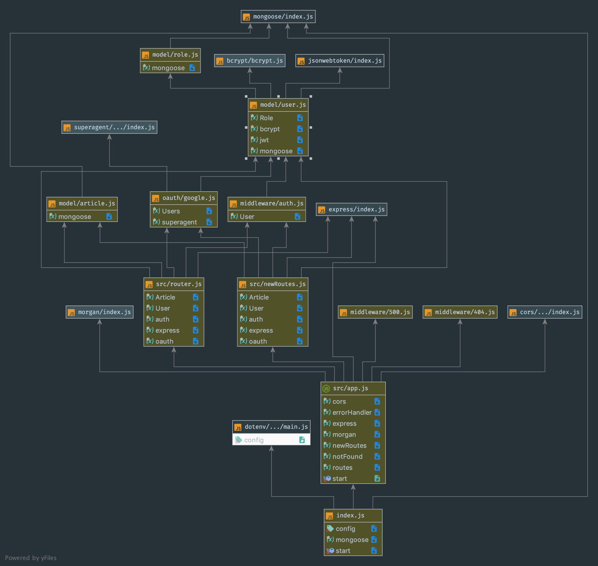

# LAB - 18

 ## ACL

 ### Author: Evan Brecht-Curry

 ### Links and Resources
* [submission PR](https://github.com/evan-401-advanced-javascript/lab-18-acl/pull/1)
* [travis](https://www.travis-ci.com/evan-401-advanced-javascript/lab-18-acl)
* [deployment](https://lab-18-acl.herokuapp.com/) 
* [docs](http://localhost:3000/docs/)

 ##### Exported Values and Methods
* `post(signup) -> {object} 200 - request token`
* `post(signin) -> {object} 200 - request token`
* `get(posts) -> {object} 200 - request token`
* `apiRouter.get('/users', (req, res, next)`
* `apiRouter.get('/secret', auth('read'), (req, res, next)`
* `apiRouter.get('/superSecret', auth('delete'), (req, res, next)`

### Setup
#### `.env` requirements
`'MONGODB_URI=mongodb://localhost:27017/lab-18`

`PORT=3000`

`SECRET='secret'`

 #### UML
